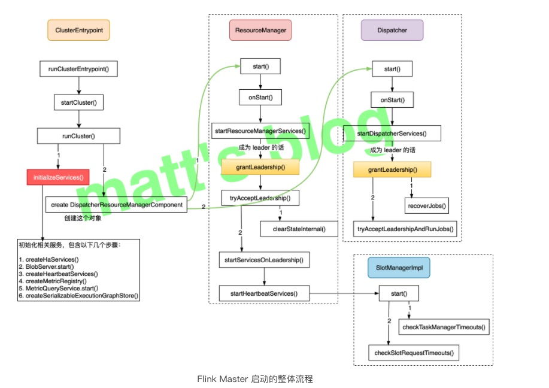
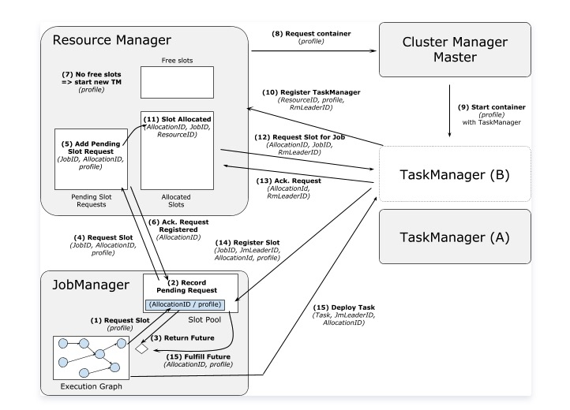

# Flink 运行架构

### Flink 运行时组件

- JobManager：
  1. 控制一个应用程序执行的主进程，即：每个应用程序都会被一个不同的JobManager所控制执行；
  2. JobManager会先接收到要执行的应用程序，这个应用程序包括：JobGraph、Logical Dataflow Graph和打包了所有的类、库和其他资源的jar包；
  3. JobManager会把JobGraph转换成一个物理层面的数据流图，这个图叫作ExecutionGraph，其包含了所有可以并发执行的任务；
  4. JobManger会向ResourceManager请求执行任务必要的资源，也就是TaskManager上的slot。一旦其获得了足够的资源，
  就会将ExecutionGraph分发到真正运行它们的TaskManager上。而在运行过程中，JobManager会负责所有需要中央协调的操作，比如checkpoints的协调等；

- TaskManager：
    1. Flink中的工作进程。通常在Flink中会有多个TaskManager运行，每个TaskManager都会包含一定数量的slots。
    slots的数量限制了TaskManager能够执行的任务数量；
    2. 启动之后，TaskManager会向ResourceManager注册它的slots，收到ResourceManager的指令后，
    TaskManager就会将一个或者多个slots提供给JobManager调用。JobManager就可以向slots分配tasks来执行了；
    3. 在执行过程中，一个TaskManager可以跟其他运行在同一应用程序的TaskManager交换数据；
- ResourceManager：
    1. 主要负责TaskManager的slots，TaskManager的slots时flink中定义的处理资源的基本单元；
    2. Flink为不同的环境和资源管理工具提供了不同的ResourceManager，比如：YARN、Mesos、K8s、standalone等；
    3. 当JobManager申请slots资源时，ResourceManager会将有空闲slots的TaskManager分配给JobManager。如果ResourceManager没有足够的slots
    来满足JobManager的请求，它还可以向资源提供平台发起会话，以提供启动TaskManager进程的容器；
    
    
- Dispatcher：（提交、取消作业；触发、取消、清理作业的savepoints；作业状态、列表查询；）
    1. 可以跨作业运行，它为应用提交提供了REST接口；
    2. 当一个应用被提交执行时，Dispatcher就会启动并将应用移交给一个JobManager；
    3. Dispatcher也会启动一个WebUI，用来方便的展示和监控作业执行的信息；
    4. Dispatcher在架构中可能并不是必须的，这取决于应用提交运行的方式；
    5. 主要是用于作业的提交、并把它们持久化、为作业创建对应的 JobManager 等；
    
    
    
- SlotManager：
    
    
### standalone任务提交流程

1. application将应用提交给Dispatcher；
2. Dispatcher启动并提交应用给JobManager；
3. JobManager收到应用请求后，向ResourceManager请求资源，即：请求slots；
4. ResourceManager收到JobManager的请求后，将启动TaskManager；
5. TaskManager将可用的slots注册到ResourceManager；
6. ResourceManager收到可用的slots后，将发出提供slots的指令给TaskManager；
7. TaskManager收到提供slots的指令后，会向JobManager提供可用的slots；
8. JobManager收到TaskManager提供的slots后，将向TaskManager提交要在slots中执行的具体任务；
9. 任务在执行过程中，不同TaskManager可以相互交换数据；

### TaskManager 和 Slots

  
1. Flink中每个TaskManager都是一个JVM进程，它可能会在独立的线程上执行一个或多个subTask；
2. 为了控制一个TaskManager能接收多少个task，TaskManager通过task slot进行控制，一个TaskManager至少有一个slot；
3. 默认情况下，Flink允许子任务共享slot，即使他们是不同任务的子任务。这样的结果是，一个slot可以保存作业的整个管道；
4. Task slot是静态的概念，是指TaskManager具有的并发执行能力；

### ExecutionGraph

1. Flink中的ExecutionGraph可以分为四层：StreamGraph --> JobGraph --> ExecutionGraph --> 物理执行图；
2. StreamGraph：是根据用户通过Stream Api编写的代码生成的最初的图，用来表示程序的拓扑结构；
3. JobGraph：是StreamGraph经过优化后生成的JobGraph，是提交给JobManager的数据结构。主要的优化为，将多个符合条件的节点chain在一起作为一个节点；
4. ExecutionGraph： 是JobManager根据JobGraph生成的，是JobGraph的并行化版本，是调度层最核心的数据结构；
5. 物理执行图： 是JobManager根据ExecutionGraph对Job进行调度后，在各个TaskManager上部署task后形成的图，并不是一个具体的数据结构；

### 时间语义
- Event Time：事件创建的时间；
- Ingestion Time：数据进入Flink的时间；
- Processing Time：执行操作算子的本地系统时间，与机器相关；

### watermark的传递

### checkpints（自动的）

- Flink故障恢复机制的核心就是应用状态的checkpoints；
- Checkpoints就是在某个时间点将所有任务的状态存一份快照；该时间点就是所有任务都恰好处理完一个相同的输入数据的时候；

### savepoints（手动的，用户自定义的）
- Flink提供了可以自定义的镜像保存功能，即：savepoints；
- 原则上，创建savepoints使用的算法和checkpoints完全相同，因此savepoints可以认为就是具有一些额外元数据的checkpoints；
- Flink不会自动创建savepoints，因此用户必须明确地触发创建操作；
- savepoints是一个强大的功能，除了故障恢复之外，savepoints可以用于：有计划的手动保存，更新应用程序，版本迁移，暂停和重启应用等等；

### end-to-end exactly-once
- 内部保障：checkpoints；
- source端：可重设数据的读取位置；
- sink端：从故障恢复时，数据不会重复写入外部系统；
    1. 幂等写入；
    2. 事务写入；
    
----------------
   
## Flink编程模型 
### 数据集类型
1. 有界数据集：批处理
2. 无界数据集：流处理
3. 统一数据处理：有界数据集和无界数据集只是相对概念，相互间可以转换；

### Flink编程接口
1. Flink SQL
2. Table API
3. DataStream API 和 DataSet API
4. Stateful Stream Process API

### 窗口类型
1. 滚动窗口（Tumbling Windows）：根据固定时间或大小进行切分，且窗口之间互不重叠；
2. 滑动窗口（Sliding Windows）：在滚动窗口基础上增加了滑动时间，且允许窗口之间发生重叠；
3. 会话窗口（Session Windows）：将某段时间内活跃程度较高的数据聚集成一个窗口进行计算，触发条件是Session Gap，
指在规定的时间内如果没有活跃数据接入，则认为窗口结束，然后触发窗口计算结果；与Tumbling Windows和Sliding Windows相比
Session Windows没有固定的Windows Size和Slide Time；
4. 全局窗口（Global Windows）：将所有具有相同key的数据分配到单个窗口中计算结果，窗口没有起始和结束时间，其需要借助triger来触发计算；

### 有状态计算
> 有状态计算是指程序计算过程中，在Flink内部存储计算产生的中间结果，并提供给后续Function或者算子使用。

#### Flink状态类型及应用
##### 状态类型
> 是否根据key分区：Keyed State 和 Operator State（Non-keyed State）

-  Keyed State：只能用于KeyedStream类型数据集对应的Functions和Operators；可通过Key Groups进行管理；
主要用于当前算子并行度发生变化时，自动重新分布KeyedState数据；
- Operator State：只和并行的算子实例绑定，与元素的key无关；支持当算子实例并行度发生变化时自动重新分配状态数据；
- Keyed State和Operator State均具有两种形式：
    1. Managed State：由Flink Runtime中控制和管理状态数据，并将其转换成内存Hash tables或者RocksDB的对象存储；
    然后将这些状态数据通过内部的接口持久化到checkpoints中，任务异常时可以通过这些状态数据恢复任务；
    2. Raw State：由算子自己管理数据结构，触发checkpoints过程中，Flink并不知道状态数据内部的数据结构，只是将其转换成bytes数据存储在Checkpo中，
    当从checkpoints恢复任务时，算子自己在反序列化出状态的数据结构；

### StateBackend：状态管理器
> 用来存储和管理Checkpoints过程中的状态数据

#### StateBackend类别
##### MemoryStateBackend
- 状态数据全部存储在JVM堆内存中；
- 缺点是：内存容量限制导致内存溢出；主机出现问题导致数据丢失；

##### FsStateBackend
- 基于文件系统的一种状态管理器；
- 适用于状态数据量非常大的情景，文件系统相对稳定且多分本的备份策略能保证数据的安全性；

##### RocksDBStateBackend
- 需要单独的引入相关的依赖包到工程中；

##### Bulk Iteration
##### Delta Iteration
##### 广播变量
##### 分布式缓存

#### 两个Operator合并的条件
1. 上下游并行度一致；
2. 下游节点的入读为1（即下游节点没有来自其他节点的输入）;
3. 上下游节点都在同一个slot group中；
4. 下游节点的chain策略为Always（可以与上下游链接，map、flatmap、filter等默认是Always）；
5. 上游节点的chain策略为Always或Head（只能与下游链接，不能与上游链接，source默认是head）；
6. 两个节点间数据分区方式是forward
7. 用户没有禁用chain；

### 任务调度与执行

### 任务状态

### 计算资源的调度

### slotGroup

### slot重用

### JobManager的组件
- BlobServer: 用来管理二进制大文件的服务，比如保存用户上传的jar文件，该服务会将其写到磁盘上。还有一些相关类，
如BlobCache，用于TaskManager向JobManager下载用户的jar文件。
- InstanceManager：用来管理当前存活的TaskManager的组件，记录了TaskManager的心跳信息等。
- CompletedCheckpointStore：用来保存已经完成的Checkpoints相关信息，持久化到内存中或者zookeeper中。
- MemoryArchivist：保存了已经提交到flink的作业的相关信息，如JobGraph等。

## TaskManger执行Task
### TaskManager的基本组件
> TaskManager是Flink中资源管理的基本组件，是所有执行任务的基本容器，提供了内存管理、IO管理、通信管理等一些列功能。

#### MemoryManager
> flink并没有把所有内存的管理都委托给JVM，因为JVM普遍存在着存储对象密度低、大内存时GC对系统影响大等问题。所以flink自己抽象了一套内存管理机制，将所有对象序列化后放在自己的MemorySegment上进行管理。MemoryManger涉及内容较多，将在后续章节进行继续剖析。

#### IOManager
> Flink通过IOManager管理磁盘IO的过程，提供了同步和异步两种写模式，又进一步区分了block、buffer和bulk三种读写方式。
> IOManager提供了两种方式枚举磁盘文件，一种是直接遍历文件夹下所有文件，另一种是计数器方式，对每个文件名以递增顺序访问。

在底层，flink将文件IO抽象为FileIOChannle，封装了底层实现。

#### NetworkEnvironment
> 是TaskManager的网络IO组件，包含了追踪中间结果和数据交换的数据结构。它的构造器会统一将配置的内存先分配出来，抽象成 NetworkBufferPool 统一管理内存的申请和释放。意思是说，在输入和输出数据时，不管是保留在本地内存，等待chain在一起的下个操作符进行处理，还是通过网络把本操作符的计算结果发送出去，都被抽象成了NetworkBufferPool。后续我们还将对这个组件进行详细分析。

### 名词解释

- StreamNode：用来代表 operator 的类，并具有所有相关的属性，如并发度、入边和出边等。
- StreamEdge：表示连接两个StreamNode的边。
- JobGraph：StreamGraph经过优化后生成了 JobGraph，提交给 JobManager 的数据结构。
- JobVertex：经过优化后符合条件的多个StreamNode可能会chain在一起生成一个JobVertex，即一个JobVertex包含一个或多个operator，JobVertex的输入是JobEdge，输出是IntermediateDataSet。
- IntermediateDataSet：表示JobVertex的输出，即经过operator处理产生的数据集。producer是JobVertex，consumer是JobEdge。
- JobEdge：代表了job graph中的一条数据传输通道。source 是 IntermediateDataSet，target 是 JobVertex。即数据通过JobEdge由IntermediateDataSet传递给目标JobVertex。
- ExecutionGraph：JobManager 根据 JobGraph 生成的分布式执行图，是调度层最核心的数据结构。
- ExecutionJobVertex：和JobGraph中的JobVertex一一对应。每一个ExecutionJobVertex都有和并发度一样多的 ExecutionVertex。
- ExecutionVertex：表示ExecutionJobVertex的其中一个并发子任务，输入是ExecutionEdge，输出是IntermediateResultPartition。
- ntermediateResult：和JobGraph中的IntermediateDataSet一一对应。每一个IntermediateResult的IntermediateResultPartition个数等于该operator的并发度。
- IntermediateResultPartition：表示ExecutionVertex的一个输出分区，producer是ExecutionVertex，consumer是若干个ExecutionEdge。
- ExecutionEdge：表示ExecutionVertex的输入，source是IntermediateResultPartition，target是ExecutionVertex。source和target都只能是一个。
- Execution：是执行一个 ExecutionVertex 的一次尝试。当发生故障或者数据需要重算的情况下 ExecutionVertex 可能会有多个 ExecutionAttemptID。一个 Execution 通过 ExecutionAttemptID 来唯一标识。JM和TM之间关于 task 的部署和 task status 的更新都是通过 ExecutionAttemptID 来确定消息接受者。
- 物理执行图：JobManager 根据 ExecutionGraph 对 Job 进行调度后，在各个TaskManager 上部署 Task 后形成的“图”，并不是一个具体的数据结构。
- Task：Execution被调度后在分配的 TaskManager 中启动对应的 Task。Task 包裹了具有用户执行逻辑的 operator。
- ResultPartition：代表由一个Task的生成的数据，和ExecutionGraph中的IntermediateResultPartition一一对应。
- ResultSubpartition：是ResultPartition的一个子分区。每个ResultPartition包含多个ResultSubpartition，其数目要由下游消费 Task 数和 DistributionPattern 来决定。
  InputGate：代表Task的输入封装，和JobGraph中JobEdge一一对应。每个InputGate消费了一个或多个的ResultPartition。
-  InputChannel：每个InputGate会包含一个以上的InputChannel，和ExecutionGraph中的ExecutionEdge一一对应，也和ResultSubpartition一对一地相连，即一个InputChannel接收一个ResultSubpartition的输出。

 
 ****
 
 ### Flink Master启动流程图

-------

### yarn申请资源

-------

### yarn申请资源
