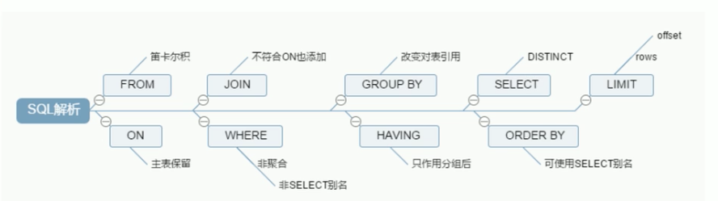

# Mysql

## SQL执行顺序
```roomsql
    select 
        <select_list>
    from
        <left_table> <join_type> join <right_table> on <join_condition>  
    where
        <where_condition>
    group by
        <group_by_list>
    having
        <having_condition>
    order by
        <order_by_condition>
    limit
        <limit_number>
```
    
    
### 机读
```
from --> join on --> where --> group by --> having --> select --> distinct --> order by --> limit
```
 
  

## index
       MySQL官方对索引的定义为：索引（Index）是帮助MySQL高效获取数据的数据结构，即索引的本质是数据结构。
    可简单理解为：排好序的以便进行快速查找的数据结构。
       在数据之外，数据库还维护着满足特定查找算的数据结构，这些数据结构以某种方式引用（指向）数据，这样就可以在这些数据结构
       上实现高级查找算法。这种数据结构就是索引。  
    
  
    