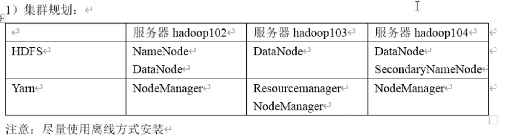
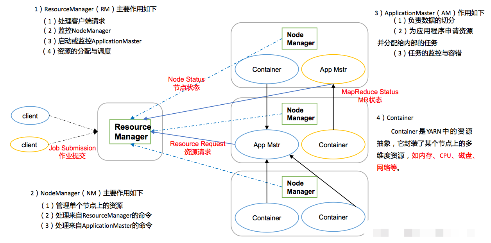

## Hadoop

### yarn启动
 1. 如果集群是第一次启动，需要格式化NameNode（注意格式化之前，一定要先停止上次启动的所有namenode和datanode进程，然后再删除data和log数据）
 2. NameNode所在节点：``bin/hdfs namenode -format``
 3. NameNode所在节点：``sbin/start-dfs.sh``
 4. RM所在节点：``sbin/start-yarn.sh``
 
#### 各个组件单独启动
1. 分别启动HDFS组件
   ```bash
    hadoop-daemon.sh  start/stop  namenode/datanode/secondarynamenode
   ```
2. 启动、停止YARN
    ```bash
    yarn-daemon.sh  start/stop  resourcemanager/nodemanager
    ```
#### 各个模块分开启动
1. 整体启动/停止HDFS
    ```bash
    start-dfs.sh/stop-dfs.sh
    ```
2. 整体启动/停止YARN
    ```bash
    start-yarn.sh/stop-yarn.sh
    ```

### 集群规划
   

- NameNode:
    存储文件元数据，如文件名、文件目录结构，文件属性（生成时间、副本数、文件权限），以及每个文件的快列表和块所在的DataNode等。
- SecondNameNode：
    用来监控HDFS状态的辅助后台程序，每隔一段时间获取HDFS元数据的快照。
- DataNode
    在本地文件系统存储文件块数据，以及块数据的校验和。

### yarn架构
   
  
### 配置文件   
##### hdfs-site.xml:
 ```xml
<configuration>
   <!-- nn web端访问地址 -->
   <property>
       <name>dfs.namenode-http-address</name>
       <value>vm01:9870</value>
   </property>
   <!-- 测试环境hdfs副本数量 -->
   <property>
       <name>dfs.replication</name>
       <value>1</value>
   </property>
    <!-- 指定Hadoop辅助名称节点主机配置 -->
    <property>
      <name>dfs.namenode.secondary.http-address</name>
      <value>vm03:50090</value>
    </property>
    <property>
       <name>dfs.namenode.handler.count</name>
        <value>21</value>
   </property>
</configuration>
 ```

##### core-site.xml
```xml
<configuration>
   <!-- NameNode地址 -->
   <property>
       <name>fs.defaultFS</name>
       <value>hdfs://vm01:8020</value>
   </property>
   <!-- 数据存储目录 -->
   <property>
       <name>hadoop.tmp.dir</name>
       <value>/opt/module/hadoop-3.1.3/data</value>
   </property>
   <!-- hdfs网页登录使用的静态用户 -->
   <property>
       <name>hadoop.http.staticuser.user</name>
       <value>root</value>
   </property>
   <!-- root用户允许通过代理访问的主节点 -->
   <property>
       <name>hadoop.proxyuser.root.hosts</name>
       <value>*</value>
   </property>
   <property>
       <name>hadoop.proxyuser.root.groups</name>
       <value>*</value>
   </property>
   <property>
       <name>io.compression.codecs</name>
       <value>
         org.apache.hadoop.io.compress.GzipCodec,
         org.apache.hadoop.io.compress.DefaultCodec,
         org.apache.hadoop.io.compress.BZip2Codec,
         org.apache.hadoop.io.compress.SnappyCodec,
         com.hadoop.compression.lzo.LzoCodec,
         com.hadoop.compression.lzo.LzopCodec
       </value>
   </property>
   <property>
       <name>io.compression.codec.lzo.class</name>
       <value>com.hadoop.compression.lzo.LzoCodec</value>
   </property>
</configuration>
```
##### yarn-site.xml
```xml
<configuration>
   <!-- Reducer获取数据的方式 -->
   <property>
      <name>yarn.nodemanager.aux-services</name>
      <value>mapreduce_shuffle</value>
   </property>
   <!-- 指定YARN的ResourceManager的地址 -->
   <property>
      <name>yarn.resourcemanager.hostname</name>
      <value>vm02</value>
   </property>
   <property>
       <name>yarn.scheduler.minimum-allocation-mb</name>
       <value>1024</value>
   </property>
   <property>
       <name>yarn.scheduler.maximum-allocation-mb</name>
       <value>8192</value>
   </property>
   <property>
        <name>yarn.nodemanager.resource.memory-mb</name>
        <value>8192</value>
   </property>
   <property>
       <name>yarn.nodemanager.pmem-check-enabled</name>
       <value>false</value>
   </property>
   <property>
       <name>yarn.nodemanager.vmem-check-enabled</name>
       <value>fale</value>
   </property>
   <!-- 开启日志聚集功能  -->
   <property>
      <name>yarn.log-aggregation-enable</name>
      <value>true</value>
   </property>
   <!-- 日志聚集服务器地址  -->
   <property>
      <name>yarn.log.server.url</name>
      <value>http://vm01:19888/jobhistory/logs</value>
   </property>
   <!-- 日志保留时间为7天  -->
   <property>
      <name>yarn.log-aggregation.retain-seconds</name>
      <value>604800</value>
   </property>
</configuration>
```

##### mapred-site.xml
```xml
<configuration>
   <!-- 指定MR运行在Yarn上 -->
   <property>
       <name>mapreduce.framework.name</name>
       <value>yarn</value>
   </property>
   <!-- 历史服务器地址 -->
   <property>
       <name>mapreduce.jobhistory.address</name>
       <value>vm01:10020</value>
   </property>
   <!-- 历史服务器web地址 -->
   <property>
       <name>mapreduce.jobhistory.webapp.address</name>
       <value>vm01:19888</value>
   </property>
   <property>
       <name>yarn.app.mapreduce.am.env</name>
       <value>HADOOP_MAPRED_HOME=${HADOOP_HOME}</value>
   </property>
   <property>
       <name>mapreduce.map.env</name>
       <value>HADOOP_MAPRED_HOME=${HADOOP_HOME}</value>
   </property>
   <property>
       <name>mapreduce.reduce.env</name>
       <value>HADOOP_MAPRED_HOME=${HADOOP_HOME}</value>
   </property>
</configuration>
```

##### works
```text
vm01
vm02
vm03
```